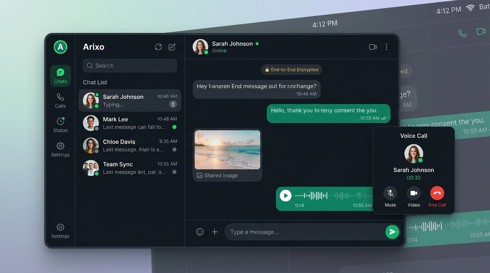

<div align="center">

# 💬 Arixo Web

**A modern, production-grade WhatsApp Web clone built with Next.js 16, React 19, TypeScript, Tailwind CSS, Google Gemini AI, and WebRTC.**

[](https://arixo-ten.vercel.app/)
[](https://nextjs.org/)
[](https://react.dev/)
[](https://www.typescriptlang.org/)
[](https://tailwindcss.com/)
[](https://developer.mozilla.org/en-US/docs/Web/API/SubtleCrypto)
[](https://ai.google.dev/)

<br />



<br />
<br />

**Arixo Web** brings the complete, pixel-accurate WhatsApp Web experience to modern web architectures — featuring real-time Server-Sent Events, WebRTC voice/video calling, end-to-end AES-GCM 256 encryption, Channels, Communities, 24-hour status stories, voice notes with waveforms, Meta AI assistant powered by Google Gemini, and complete settings customization.

**🌐 Live Demo:** [https://arixo-ten.vercel.app/](https://arixo-ten.vercel.app/)

</div>

---

## 🌟 Highlights & Key Features

### 🔒 End-to-End Encryption (E2EE)
- **AES-GCM 256-Bit Cryptography**: Uses the browser's native Web Crypto API (`crypto.subtle`) for client-side encryption and decryption.
- **Deterministic Key Derivation**: AES keys are derived per conversation using PBKDF2/SHA-256, ensuring messages remain unreadable to servers, eavesdroppers, or network intermediaries.
- **In-Memory Decryption Cache**: Eliminates layout shifts and ciphertext flashes on re-renders, providing instant smooth message rendering.

### 🧭 WhatsApp Web Navigation Rail & Mobile Bottom Bar
- **Desktop Left Icon Rail (`w-[64px]`)**:
  - **Chats**: Instant access with unread counter badges.
  - **Status / Stories**: Circular segmented ring with green update indicator.
  - **Channels**: Broadcast radio icon for the Channels feed.
  - **Communities**: Hub for community announcements and sub-groups.
  - **Meta AI**: WhatsApp gradient ring icon with sparkles for instant AI conversations.
  - **Calls**: Direct access to synced call history and redials.
  - **Starred Messages**: Global drawer of all starred messages across chats.
  - **Archived Chats**: Fast filtering for archived conversations.
  - **Settings**: Full-featured WhatsApp settings drawer.
  - **User Profile**: Avatar with green online status ring and drawer.
- **Mobile Bottom Navigation Bar (< 768px)**:
  - Native mobile bar with **Chats**, **Updates**, **Communities**, **Calls**, and **Settings**.

### ⚡ Real-Time Messaging & Vertical Stability
- **SSE Stream + Fallback Sync**: High-efficiency Server-Sent Events (`connectChatStream`) deliver instantaneous message updates with zero latency.
- **Stable Sorting & Deduplication**: Deterministic secondary key tie-breaking (`id.localeCompare`) guarantees messages never jump or swap order on background syncs.
- **Optimistic UI Updates**: Immediate message appearance with client-generated IDs that reconcile cleanly with server broadcasts.
- **WhatsApp Quoted Replies**: Reply directly to specific messages with preview cards in both direct and group conversations.
- **Read Receipts & Ticks**: Real-time delivered and read ticks (double blue checkmarks) with formatted timestamps.

### 🗑️ "Delete for Me" & "Delete for Everyone"
- **Interactive WhatsApp Confirmation Modal**: Choose between local deletion or global revocation.
- **Delete for Everyone**:
  - Sender: Displays an authentic revoked indicator: *"You deleted this message"* with 🚫 icon.
  - Recipient: Instant real-time update displaying *"This message was deleted"*.
  - Automatically wipes attached media, reactions, and stars.
- **Delete for Me**:
  - Hides the message solely for the requesting user across sessions while keeping it visible to others.

### ⭐ Starred Messages & Drawer
- **Quick Star Action**: Hover chevron dropdown and right-click context menu to star or unstar important messages.
- **Dedicated Starred Messages Drawer**:
  - Instant toggle between "This Chat" and "All Chats".
  - Full client-side decryption for encrypted starred messages.
  - Rich media thumbnails, voice note audio players, and document metadata.
  - One-click "Jump to chat" navigation.

### 👥 Group Conversations & Management
- **Full Group Chat Support**: Create multi-user groups with custom group avatars and descriptions.
- **Participant Badges**: Distinctive "You" and "Group Admin" badges in participant rosters.
- **Group Info Drawer**:
  - Real-time inline group name editing.
  - Participant management: add new contacts or remove existing members.
  - Shared media and starred messages overview.
  - Safe "Exit Group" functionality.
- **Colored Sender Tags**: WhatsApp-style colored display names for participants inside group message bubbles.

### 📢 Channels & Communities Hubs
- **Channels Directory**: Follow popular channels (WhatsApp Official, UEFA Champions League, Tech Radar) with live follower counts, update posts, and emoji reactions (💚, 🔥, ⚽, 🚀).
- **Communities Hub**: Organize related groups under common umbrella communities with announcement channels.

### 🤖 Google Gemini-Powered Meta AI
- **Powered by Google Gemini**: Connected to official Google Gemini API with smart model fallback (`gemini-2.5-flash`, `gemini-2.5-flash-lite`).
- **Integrated Assistant Interface**:
  - Multi-turn conversation memory with persistent local history.
  - Prompt suggestion chips for instant inspiration.
  - Animated WhatsApp typing bubble (*"Meta AI is thinking..."*).
  - 1-click **Copy response** button with checkmark feedback.
  - Clear chat history action with confirmation.

### 📎 Multimedia & Voice Notes
- **High-Res Photos & Lightbox**: Send and receive photos with inline preview and high-resolution lightbox views.
- **Video Playback**: Built-in HTML5 video streaming and playback.
- **Voice Notes**:
  - Interactive audio recording with live mic visualizer.
  - Playback waveform animation with speed controls (1x, 1.5x, 2x).
- **Documents & Files**: Document transmission with format icons, file size counters, and one-click download.

### 📞 WebRTC Voice & Video Calling
- **Peer-to-Peer Streaming**: High-quality real-time voice and video calls powered by WebRTC.
- **Real-Time Signaling**: Dual signaling pipeline via Server-Sent Events (`/api/chat/signaling`) and universal signaling client.
- **Call State Overlays**: Incoming call ringers, accept/reject modals, mic muting, camera switching, and duration timer.

### 📸 Stories / 24-Hour Status Updates
- **WhatsApp Status Clone**: Post temporary text or photo stories that automatically expire after 24 hours.
- **Interactive Story Viewer**: Fullscreen story carousel with playback progress bars and direct reply to story as a chat message.

### ⚙️ WhatsApp Settings & Customization
- **Profile**: Photo upload, display name editing, status bio presets (*"Available"*, *"Busy"*, *"At work"*, etc.).
- **Privacy**: Last Seen & Online controls, read receipts toggle (blue checkmarks), disappearing messages default timer.
- **Chat Wallpapers**: Authentic WhatsApp doodle pattern overlay with selectable curated color themes.
- **Keyboard Shortcuts**: Complete WhatsApp Web hotkeys dialog (Ctrl+N, Ctrl+Shift+[, Ctrl+Shift+], Ctrl+Backspace, Ctrl+/).

### 🖼️ Zero-Cookie-Bloat Avatar Architecture
- **Persistent Multi-Tiered Delivery**:
  - Client stores only clean lightweight endpoint URLs (`/api/chat/avatar?userId=...`) in metadata, completely preventing HTTP 431 / `net::ERR_CONNECTION_CLOSED` cookie header bloat.
  - Endpoint resolves avatars across in-memory cache, pre-seeded bundled assets, static files, and disk storage, ensuring permanent visibility on Vercel serverless deployments.

---

## 🏗️ Architecture & Tech Stack

```
arixo-web/
├── app/                        # Next.js 16 App Router
│   ├── api/ai/                 # Google Gemini Meta AI endpoint
│   ├── api/chat/               # REST & SSE endpoints
│   │   ├── avatar/             # Binary profile photo delivery
│   │   ├── calls/              # Call session state
│   │   ├── channels/           # WhatsApp Channels feed
│   │   ├── communities/        # WhatsApp Communities management
│   │   ├── conversations/      # Group & direct chat management
│   │   ├── messages/           # CRUD, reactions, stars, deletion
│   │   ├── signaling/          # WebRTC SDP/ICE signaling
│   │   ├── stories/            # 24-hour status stories
│   │   └── sync/               # Real-time SSE event stream
│   ├── auth/                   # Supabase authentication pages
│   └── chat/                   # Main chat page and layout
├── components/                 # React UI components
│   ├── chat/                   # WhatsApp interface components
│   │   ├── channels-view.tsx   # Channels directory & updates
│   │   ├── chat-layout.tsx     # Sidebar, navigation rail, call overlays
│   │   ├── chat-sidebar.tsx    # Conversations list, search, filters
│   │   ├── chat-window.tsx     # Message viewport, input, actions
│   │   ├── communities-view.tsx# Communities directory
│   │   ├── contact-info-drawer.tsx # Contact profile & media
│   │   ├── group-info-drawer.tsx   # Group members & settings
│   │   ├── message-bubble.tsx  # Bubbles, context menu, media, E2EE
│   │   ├── meta-ai-view.tsx    # Google Gemini Meta AI interface
│   │   ├── nav-rail.tsx        # WhatsApp left icon rail & bottom bar
│   │   ├── profile-drawer.tsx  # User profile & photo upload
│   │   ├── settings-drawer.tsx # WhatsApp settings, themes, shortcuts
│   │   ├── starred-messages-drawer.tsx # Starred message browser
│   │   └── stories-view.tsx    # Status updates and story carousel
│   └── ui/                     # Radix UI primitives & buttons
├── lib/                        # Core utilities & services
│   ├── chat-api.ts             # Client API bindings & SSE stream
│   ├── encryption.ts           # Web Crypto AES-GCM 256 E2EE
│   ├── seed-avatars.ts         # Pre-seeded persistent avatar data
│   ├── server-store.ts         # Persistent data store & event bus
│   └── supabase/               # Client and SSR authentication
└── public/avatars/             # Static avatar assets
```

---

## 🚀 Getting Started

### Prerequisites
- **Node.js**: `v18.18.0` or higher
- **Package Manager**: `npm`, `pnpm`, or `yarn`

### 1. Clone the Repository
```bash
git clone https://github.com/Arijdev/Arixo.git
cd Arixo
```

### 2. Install Dependencies
```bash
npm install
```

### 3. Environment Configuration
Create a `.env.local` file in the project root:

```env
# Supabase Configuration
NEXT_PUBLIC_SUPABASE_URL="https://<your-project-id>.supabase.co"
NEXT_PUBLIC_SUPABASE_ANON_KEY="<your-supabase-anon-key>"

# Optional: Google Gemini API Key for Meta AI Assistant
GEMINI_API_KEY="<your-google-gemini-api-key>"
```

*(If Supabase credentials are not provided, Arixo Web gracefully falls back to local storage authentication mode for instant local testing).*

### 4. Run Development Server
```bash
npm run dev
```

Open [http://localhost:3000](http://localhost:3000) with your browser to experience Arixo Web.

### 5. Production Build
```bash
npm run build
npm start
```

---

## 🔐 Security & Privacy Architecture

| Feature | Implementation | Benefit |
| :--- | :--- | :--- |
| **End-to-End Encryption** | Web Crypto API AES-GCM 256-bit | Plaintext messages never transit the network unencrypted |
| **Token & Avatar Sanitization** | Detached binary endpoints & local cache | Eliminates cookie bloat and mitigates `HTTP 431` vulnerabilities |
| **Zero-Knowledge Media** | Detached binary endpoints (`/api/chat/avatar`) | Eliminates Base64 JWT cookie pollution while preserving photos |
| **Granular Deletion** | Dual-track `is_deleted_for_everyone` & `deleted_for[]` | Sender has revocation authority; user retains local clearing control |
| **Direct Peer-to-Peer Calls** | WebRTC with ephemeral signaling | Audio/video streams pass directly between browsers |

---

## 📄 License

Distributed under the MIT License. See `LICENSE` for more information.

<div align="center">
  <sub>Built with ❤️ by Arijit Chowdhury and the open-source community.</sub>
</div>
